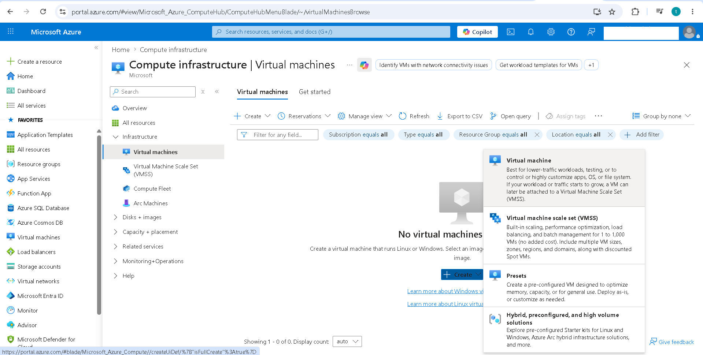
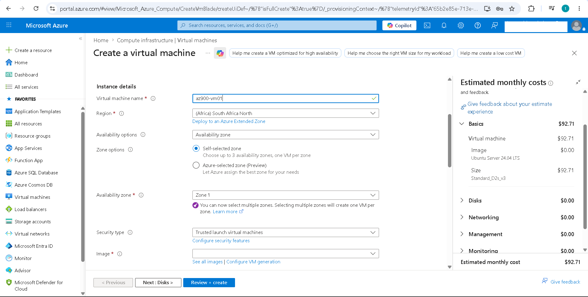
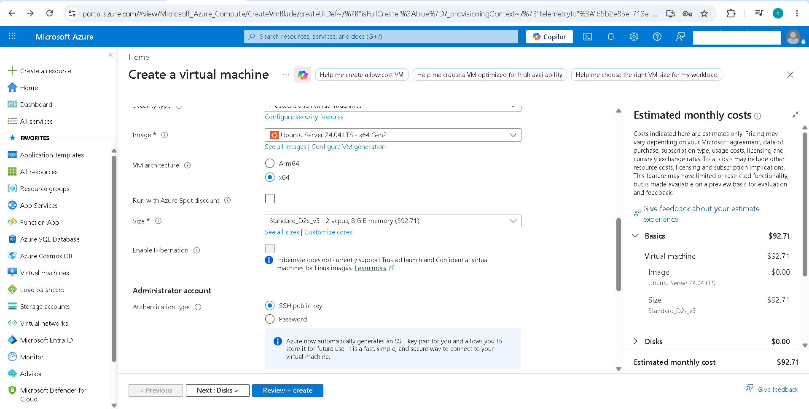
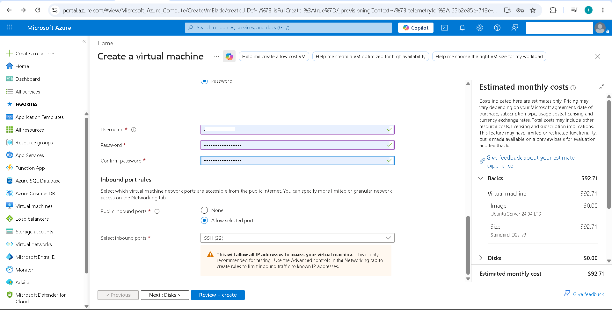
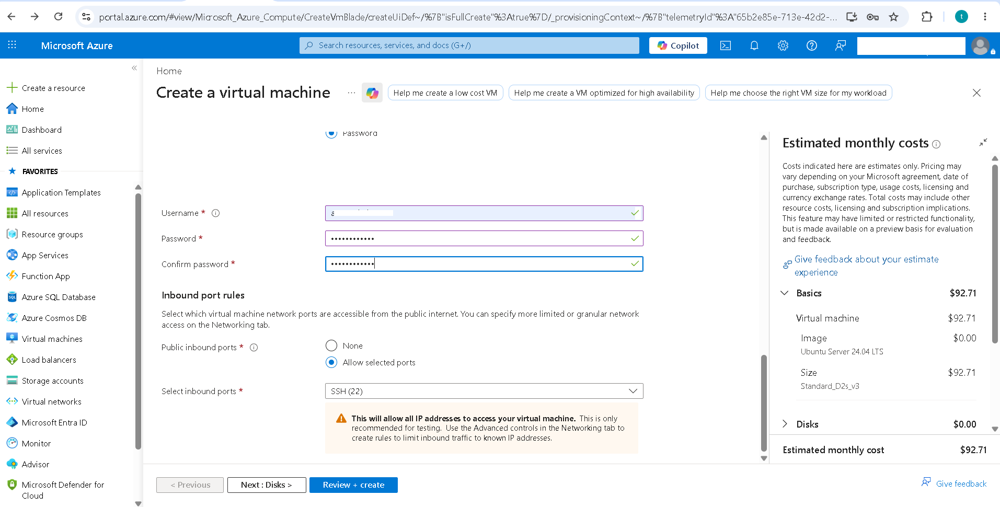
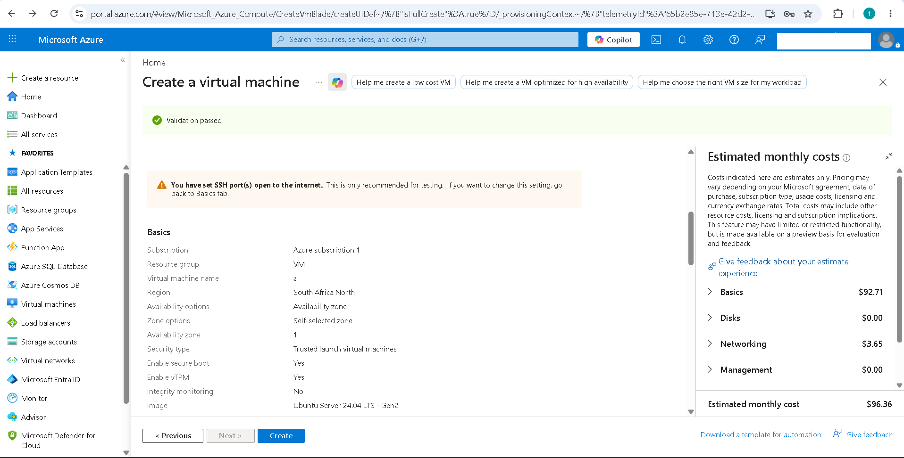
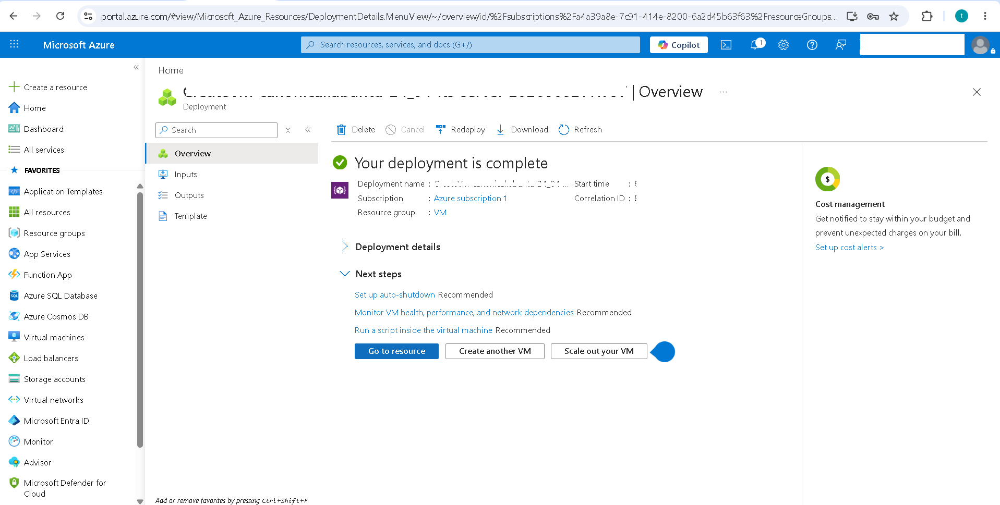
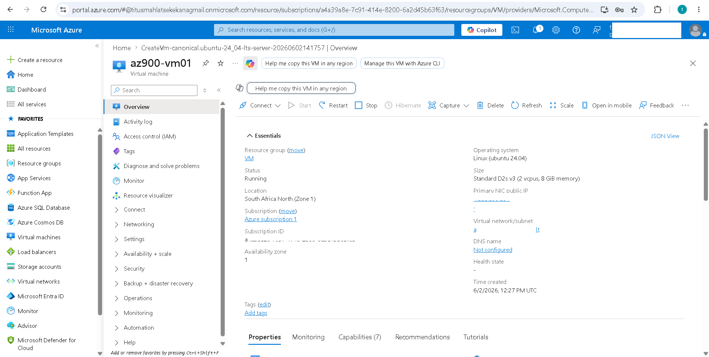
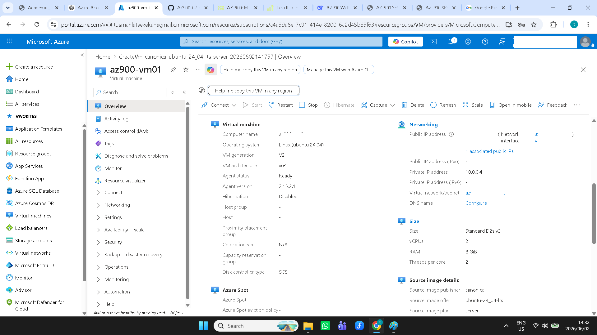

# AZ-900 Lab 03 – Creating My First Azure Virtual Machine

## Introduction

As part of my Microsoft Azure Fundamentals (AZ-900) learning journey, I deployed my first Virtual Machine (VM) in Azure.

This project gave me practical experience with Infrastructure as a Service (IaaS) and helped me understand the resources Azure creates behind the scenes when deploying a virtual machine.

Before this lab, I understood virtual machines conceptually. After completing it, I had hands-on experience creating, configuring, and managing a VM in a real cloud environment.

---

## Project Objectives

The goal of this project was to:

- Create an Azure Virtual Machine
- Understand Infrastructure as a Service (IaaS)
- Explore Resource Groups
- Configure networking settings
- Learn how Azure organizes resources
- Gain practical cloud deployment experience

---

## Exploring Azure Virtual Machines

I started by accessing the Virtual Machines service in the Azure Portal and exploring the options available for creating compute resources.

---

## Configuring the Virtual Machine

During deployment, I configured the basic settings for the virtual machine, including:

- Resource Group
- Virtual Machine Name
- Region
- Availability Options

This helped me understand the key decisions involved when deploying cloud infrastructure.

---

## Selecting an Operating System and Size

I selected an operating system image and reviewed the available VM sizes.

This introduced me to the concept of cloud compute resources and how organizations can choose different VM sizes depending on workload requirements.

---

## Creating an Administrator Account

I configured administrator credentials that would later be used to access and manage the virtual machine.

This step highlighted the importance of secure authentication and access management.

---

## Configuring Networking

I reviewed the networking configuration and enabled the required inbound access settings for the virtual machine.

This helped me understand how Azure controls network traffic and resource accessibility.

---

## Reviewing and Deploying

Before deployment, Azure validated the configuration and provided a summary of all selected options.

This review process helped me understand the resources that would be created.

---

## Deployment Successful

After a few minutes, Azure completed the deployment and successfully created the virtual machine.

This was my first successful deployment of a cloud compute resource.

---

## Virtual Machine Overview

I explored the virtual machine overview page and reviewed information such as:

- VM Status
- Region
- Public IP Address
- Resource Group
- Operating System

This page serves as the central location for managing the virtual machine.

---

## Exploring the Resource Group

One of the most valuable parts of this project was exploring the Resource Group.

I discovered that deploying a single virtual machine automatically creates several supporting resources, including:

- Virtual Machine
- Virtual Network
- Network Interface
- Public IP Address
- Disk Storage
- Network Security Group

This helped me understand how Azure resources work together.

---

## What I Learned

This project helped me understand:

### Infrastructure as a Service (IaaS)

Azure Virtual Machines are an example of IaaS, where Microsoft provides the infrastructure while users manage the operating system and applications.

### Resource Groups

Resource Groups act as logical containers used to organize and manage related Azure resources.

### Virtual Networking

Virtual Machines rely on networking resources such as virtual networks, public IP addresses, and network security groups.

### Cloud Deployment

Deploying cloud resources involves planning, configuration, security considerations, and cost awareness.

---

## Challenges

As a first-time Azure user, the number of deployment options initially felt overwhelming.

However, working through each configuration screen helped me understand how cloud resources are provisioned and managed in Azure.

---

## Reflection

This project was an important milestone in my cloud learning journey.

Creating a virtual machine transformed cloud computing from a theoretical concept into something tangible that I could deploy and manage myself.

It also gave me a better understanding of how Azure services are connected and prepared me for future projects involving web servers, networking, storage, and security.

---

## Skills Developed

- Microsoft Azure Fundamentals
- Azure Virtual Machines
- Infrastructure as a Service (IaaS)
- Resource Groups
- Azure Networking Basics
- Cloud Infrastructure
- Cloud Resource Management

---

## Author

**Lesibana Titus Kekana**

Information Technology Graduate

Microsoft Azure Fundamentals (AZ-900) Portfolio Series
